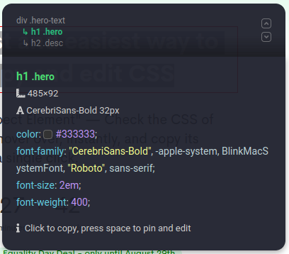

Doodle CSS is a simple hand drawn HTML/CSS theme.

[](https://chr15m.github.io/DoodleCSS)

[Demo and more HTML elements](https://chr15m.github.io/DoodleCSS).

# How to use it

The main stylesheet is [doodle.css](./doodle.css).

```html
<link rel="stylesheet" href="doodle.css">
```

Then add the class `doodle` to the top level element you want to apply the theme to:

```html
<body class="doodle">...</body>
```

Load the Short Stack web font:
```html
<style>
@import url('https://fonts.googleapis.com/css2?family=Short+Stack&display=swap');
body {
  font-family: 'Short Stack', cursive;
}
</style>
```

There's also an npm installable version:

```
npm install doodle.css
```

The npm package can be imported with:

```
import 'doodle.css/doodle.css'
```

There are are bunch of other vectors you can use in [doodles.svg](./doodles.svg).

You can also put a doodle box around anything using the class `.doodle .border` or `.doodle-border`.

# Sponsor

[CSS Scan is the fastest easiest way to check, copy, and edit CSS](https://gumroad.com/a/142499667/fULny).
It's like a souped-up devtools inspector with rockets attached.
Thanks to [CSS Scan](https://gumroad.com/a/142499667/fULny) for sponsoring DoodleCSS!

[](https://gumroad.com/a/142499667/fULny)

# Who

By [Chris McCormick](https://mccormick.cx/) ([@mccrmx](https://twitter.com/mccrmx)).

See [the demo](https://chr15m.github.io/DoodleCSS) for thanks and resources used.
